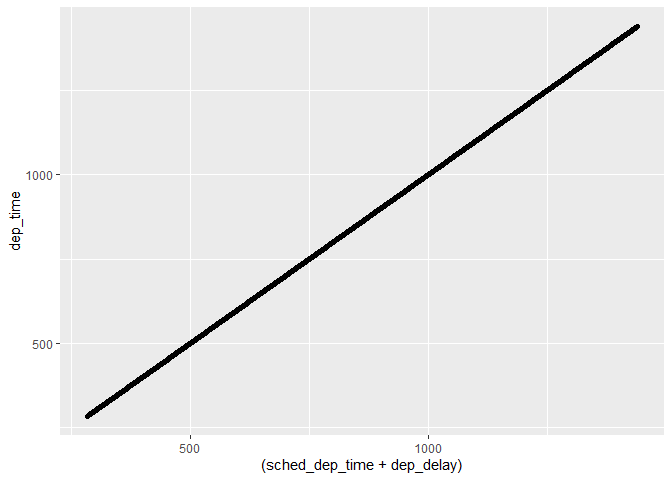
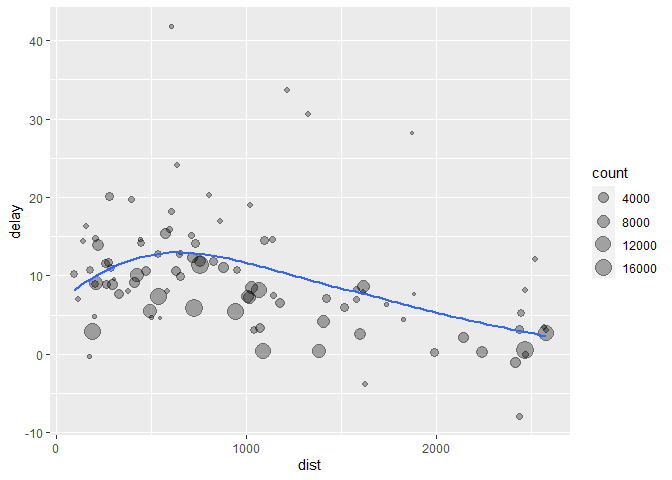
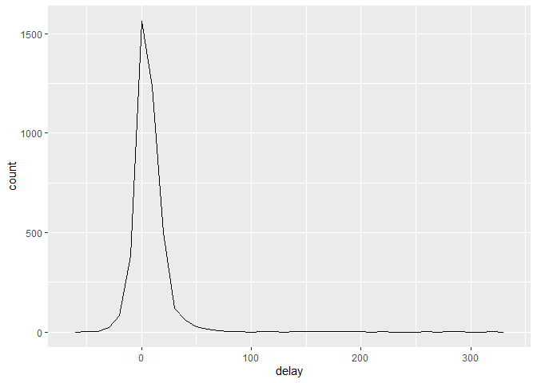
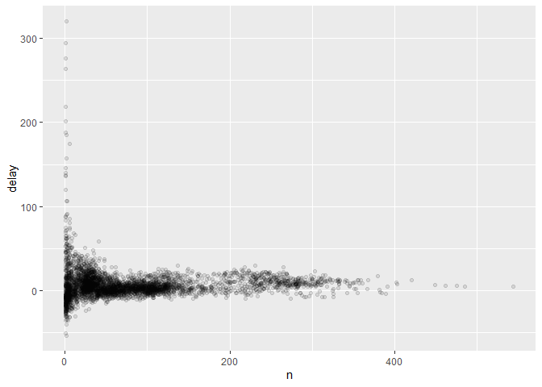
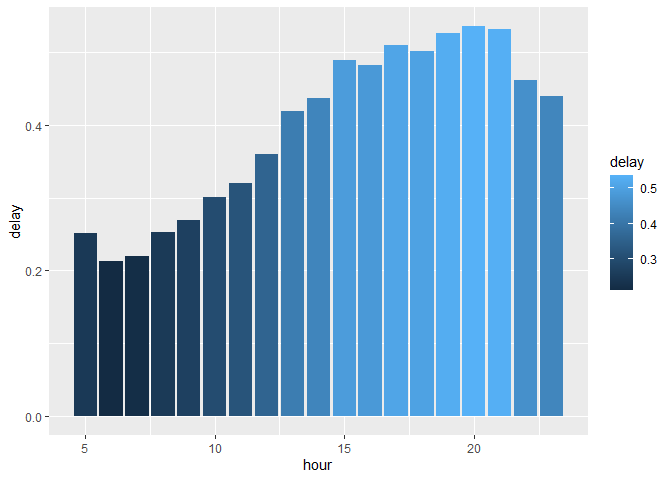
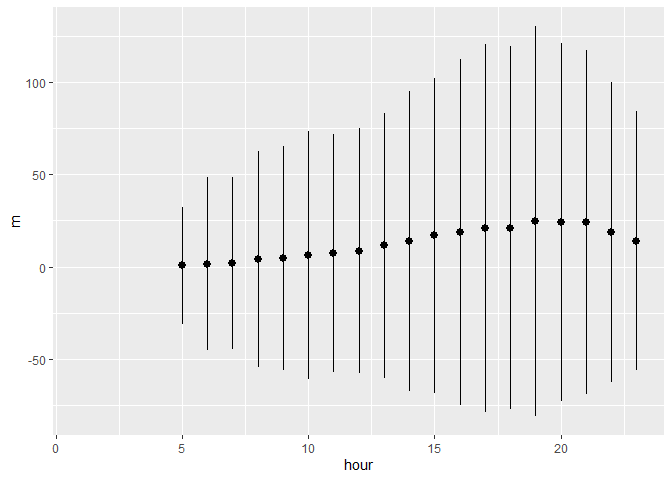

5.1 Introduction Visualisation is an important tool for insight
generation, but it is rare that you get the data in exactly the right
form you need. Often you’ll need to create some new variables or
summaries, or maybe you just want to rename the variables or reorder the
observations in order to make the data a little easier to work with.

You’ll learn how to do all that (and more\!) in this note, which will
teach you how to transform your data using the dplyr package and a new
dataset on flights departing New York City in 2013.

``` r
library(nycflights13)
library(dplyr)
```

    ## 
    ## Attaching package: 'dplyr'

    ## The following objects are masked from 'package:stats':
    ## 
    ##     filter, lag

    ## The following objects are masked from 'package:base':
    ## 
    ##     intersect, setdiff, setequal, union

To explore the basic data manipulation verbs of dplyr, we’ll use
nycflights13::flights. This data frame contains all 336,776 flights that
departed from New York City in 2013. The data comes from the US Bureau
of Transportation Statistics, and is documented in ?flights.

``` r
dim(flights)
```

    ## [1] 336776     19

``` r
str(flights)
```

    ## tibble [336,776 x 19] (S3: tbl_df/tbl/data.frame)
    ##  $ year          : int [1:336776] 2013 2013 2013 2013 2013 2013 2013 2013 2013 2013 ...
    ##  $ month         : int [1:336776] 1 1 1 1 1 1 1 1 1 1 ...
    ##  $ day           : int [1:336776] 1 1 1 1 1 1 1 1 1 1 ...
    ##  $ dep_time      : int [1:336776] 517 533 542 544 554 554 555 557 557 558 ...
    ##  $ sched_dep_time: int [1:336776] 515 529 540 545 600 558 600 600 600 600 ...
    ##  $ dep_delay     : num [1:336776] 2 4 2 -1 -6 -4 -5 -3 -3 -2 ...
    ##  $ arr_time      : int [1:336776] 830 850 923 1004 812 740 913 709 838 753 ...
    ##  $ sched_arr_time: int [1:336776] 819 830 850 1022 837 728 854 723 846 745 ...
    ##  $ arr_delay     : num [1:336776] 11 20 33 -18 -25 12 19 -14 -8 8 ...
    ##  $ carrier       : chr [1:336776] "UA" "UA" "AA" "B6" ...
    ##  $ flight        : int [1:336776] 1545 1714 1141 725 461 1696 507 5708 79 301 ...
    ##  $ tailnum       : chr [1:336776] "N14228" "N24211" "N619AA" "N804JB" ...
    ##  $ origin        : chr [1:336776] "EWR" "LGA" "JFK" "JFK" ...
    ##  $ dest          : chr [1:336776] "IAH" "IAH" "MIA" "BQN" ...
    ##  $ air_time      : num [1:336776] 227 227 160 183 116 150 158 53 140 138 ...
    ##  $ distance      : num [1:336776] 1400 1416 1089 1576 762 ...
    ##  $ hour          : num [1:336776] 5 5 5 5 6 5 6 6 6 6 ...
    ##  $ minute        : num [1:336776] 15 29 40 45 0 58 0 0 0 0 ...
    ##  $ time_hour     : POSIXct[1:336776], format: "2013-01-01 05:00:00" "2013-01-01 05:00:00" ...

You might also have noticed the row of three (or four) letter
abbreviations under the column names. These describe the type of each
variable:

1.  int stands for integers.
2.  dbl stands for doubles, or real numbers.
3.  chr stands for character vectors, or strings.
4.  dttm stands for date-times (a date + a time).

There are three other common types of variables that aren’t used in this
dataset but you’ll encounter later in the book: 1. lgl stands for
logical, vectors that contain only TRUE or FALSE. 2. fctr stands for
factors, which R uses to represent categorical variables with fixed
possible values. 3. date stands for dates.

``` r
flights <- flights
```

In this chapter you are going to learn the five key dplyr functions that
allow you to solve the vast majority of your data manipulation
challenges:

1.  Pick observations by their values (filter()).
2.  Reorder the rows (arrange()).
3.  Pick variables by their names (select()).
4.  Create new variables with functions of existing variables
    (mutate()).
5.  Collapse many values down to a single summary (summarise()).

\#Filter()

``` r
filter(flights, month == 1)
```

    ## # A tibble: 27,004 x 19
    ##     year month   day dep_time sched_dep_time dep_delay arr_time sched_arr_time
    ##    <int> <int> <int>    <int>          <int>     <dbl>    <int>          <int>
    ##  1  2013     1     1      517            515         2      830            819
    ##  2  2013     1     1      533            529         4      850            830
    ##  3  2013     1     1      542            540         2      923            850
    ##  4  2013     1     1      544            545        -1     1004           1022
    ##  5  2013     1     1      554            600        -6      812            837
    ##  6  2013     1     1      554            558        -4      740            728
    ##  7  2013     1     1      555            600        -5      913            854
    ##  8  2013     1     1      557            600        -3      709            723
    ##  9  2013     1     1      557            600        -3      838            846
    ## 10  2013     1     1      558            600        -2      753            745
    ## # ... with 26,994 more rows, and 11 more variables: arr_delay <dbl>,
    ## #   carrier <chr>, flight <int>, tailnum <chr>, origin <chr>, dest <chr>,
    ## #   air_time <dbl>, distance <dbl>, hour <dbl>, minute <dbl>, time_hour <dttm>

Before we go any futher, let’s introduce the pipe operator: %\>%. dplyr
imports this operator from another package (magrittr). This operator
allows you to pipe the output from one function to the input of another
function.

``` r
#filter(flights, month == 1)
#is the same as 

flights %>% filter(month == 1)
```

    ## # A tibble: 27,004 x 19
    ##     year month   day dep_time sched_dep_time dep_delay arr_time sched_arr_time
    ##    <int> <int> <int>    <int>          <int>     <dbl>    <int>          <int>
    ##  1  2013     1     1      517            515         2      830            819
    ##  2  2013     1     1      533            529         4      850            830
    ##  3  2013     1     1      542            540         2      923            850
    ##  4  2013     1     1      544            545        -1     1004           1022
    ##  5  2013     1     1      554            600        -6      812            837
    ##  6  2013     1     1      554            558        -4      740            728
    ##  7  2013     1     1      555            600        -5      913            854
    ##  8  2013     1     1      557            600        -3      709            723
    ##  9  2013     1     1      557            600        -3      838            846
    ## 10  2013     1     1      558            600        -2      753            745
    ## # ... with 26,994 more rows, and 11 more variables: arr_delay <dbl>,
    ## #   carrier <chr>, flight <int>, tailnum <chr>, origin <chr>, dest <chr>,
    ## #   air_time <dbl>, distance <dbl>, hour <dbl>, minute <dbl>, time_hour <dttm>

Multiple arguments to filter() are combined with “and”: every expression
must be true in order for a row to be included in the output. For other
types of combinations, you’ll need to use Boolean operators yourself: &
is “and”, | is “or”, and \! is “not”. Figure 5.1 shows the complete set
of Boolean operations.

``` r
temp <- flights %>% filter(month == 11 | month == 12)
```

``` r
#or using the %in%, which select all elements in the vector afterwards 

nov_dec <- filter(flights, month %in% c(11, 12))
nov_dec <- flights %>% filter(month %in% c(11, 12))

nov_dec
```

    ## # A tibble: 55,403 x 19
    ##     year month   day dep_time sched_dep_time dep_delay arr_time sched_arr_time
    ##    <int> <int> <int>    <int>          <int>     <dbl>    <int>          <int>
    ##  1  2013    11     1        5           2359         6      352            345
    ##  2  2013    11     1       35           2250       105      123           2356
    ##  3  2013    11     1      455            500        -5      641            651
    ##  4  2013    11     1      539            545        -6      856            827
    ##  5  2013    11     1      542            545        -3      831            855
    ##  6  2013    11     1      549            600       -11      912            923
    ##  7  2013    11     1      550            600       -10      705            659
    ##  8  2013    11     1      554            600        -6      659            701
    ##  9  2013    11     1      554            600        -6      826            827
    ## 10  2013    11     1      554            600        -6      749            751
    ## # ... with 55,393 more rows, and 11 more variables: arr_delay <dbl>,
    ## #   carrier <chr>, flight <int>, tailnum <chr>, origin <chr>, dest <chr>,
    ## #   air_time <dbl>, distance <dbl>, hour <dbl>, minute <dbl>, time_hour <dttm>

For example, if you wanted to find flights that weren’t delayed (on
arrival or departure) by more than two hours, you could use either of
the following two filters:

``` r
filter(flights, !(arr_delay > 120 | dep_delay > 120))
```

    ## # A tibble: 316,050 x 19
    ##     year month   day dep_time sched_dep_time dep_delay arr_time sched_arr_time
    ##    <int> <int> <int>    <int>          <int>     <dbl>    <int>          <int>
    ##  1  2013     1     1      517            515         2      830            819
    ##  2  2013     1     1      533            529         4      850            830
    ##  3  2013     1     1      542            540         2      923            850
    ##  4  2013     1     1      544            545        -1     1004           1022
    ##  5  2013     1     1      554            600        -6      812            837
    ##  6  2013     1     1      554            558        -4      740            728
    ##  7  2013     1     1      555            600        -5      913            854
    ##  8  2013     1     1      557            600        -3      709            723
    ##  9  2013     1     1      557            600        -3      838            846
    ## 10  2013     1     1      558            600        -2      753            745
    ## # ... with 316,040 more rows, and 11 more variables: arr_delay <dbl>,
    ## #   carrier <chr>, flight <int>, tailnum <chr>, origin <chr>, dest <chr>,
    ## #   air_time <dbl>, distance <dbl>, hour <dbl>, minute <dbl>, time_hour <dttm>

``` r
#is equal to

filter(flights, arr_delay <= 120, dep_delay <= 120)
```

    ## # A tibble: 316,050 x 19
    ##     year month   day dep_time sched_dep_time dep_delay arr_time sched_arr_time
    ##    <int> <int> <int>    <int>          <int>     <dbl>    <int>          <int>
    ##  1  2013     1     1      517            515         2      830            819
    ##  2  2013     1     1      533            529         4      850            830
    ##  3  2013     1     1      542            540         2      923            850
    ##  4  2013     1     1      544            545        -1     1004           1022
    ##  5  2013     1     1      554            600        -6      812            837
    ##  6  2013     1     1      554            558        -4      740            728
    ##  7  2013     1     1      555            600        -5      913            854
    ##  8  2013     1     1      557            600        -3      709            723
    ##  9  2013     1     1      557            600        -3      838            846
    ## 10  2013     1     1      558            600        -2      753            745
    ## # ... with 316,040 more rows, and 11 more variables: arr_delay <dbl>,
    ## #   carrier <chr>, flight <int>, tailnum <chr>, origin <chr>, dest <chr>,
    ## #   air_time <dbl>, distance <dbl>, hour <dbl>, minute <dbl>, time_hour <dttm>

Find all flights that

1.  Had an arrival delay of two or more hours
    
      - Flew to Houston (IAH or HOU)
      - Were operated by United, American, or Delta (c(“UA”,“DL”,“AA”))
      - Departed in summer (July, August, and September)
      - Arrived more than two hours late, but didn’t leave late
      - Departed between midnight and 6am (inclusive)

2.  Another useful dplyr filtering helper is between(). What does it do?
    Can you use it to simplify the code needed to answer the previous
    challenges?

3.  How many flights have a missing dep\_time? What other variables are
    missing? What might these rows represent?

<!-- end list -->

``` r
#1. Had an arrival delay of two or more hours
  #    + Flew to Houston (IAH or HOU) 
  flights %>% filter(arr_delay >= 120, dest %in% c("IAH","HOU"))
```

    ## # A tibble: 220 x 19
    ##     year month   day dep_time sched_dep_time dep_delay arr_time sched_arr_time
    ##    <int> <int> <int>    <int>          <int>     <dbl>    <int>          <int>
    ##  1  2013     1     1     1114            900       134     1447           1222
    ##  2  2013     1    10     2137           1630       307       17           1925
    ##  3  2013     1    15     1603           1446        77     1957           1757
    ##  4  2013     1    16     1239           1043       116     1558           1340
    ##  5  2013     1    20     2136           1700       276       27           2011
    ##  6  2013     1    21     1708           1446       142     2032           1757
    ##  7  2013     1    25     1409           1155       134     1710           1459
    ##  8  2013     1    30     2312           2040       152      227           2345
    ##  9  2013     1    31     1837           1635       122     2241           1945
    ## 10  2013     1    31     2123           1856       147       49           2204
    ## # ... with 210 more rows, and 11 more variables: arr_delay <dbl>,
    ## #   carrier <chr>, flight <int>, tailnum <chr>, origin <chr>, dest <chr>,
    ## #   air_time <dbl>, distance <dbl>, hour <dbl>, minute <dbl>, time_hour <dttm>

``` r
  #Were operated by United, American, or Delta #https://en.wikipedia.org/wiki/American_Airlines
  flights %>% filter(arr_delay >= 120, carrier %in% c("UA","DL","AA"))
```

    ## # A tibble: 3,280 x 19
    ##     year month   day dep_time sched_dep_time dep_delay arr_time sched_arr_time
    ##    <int> <int> <int>    <int>          <int>     <dbl>    <int>          <int>
    ##  1  2013     1     1      957            733       144     1056            853
    ##  2  2013     1     1     1114            900       134     1447           1222
    ##  3  2013     1     1     1856           1645       131     2212           2005
    ##  4  2013     1     1     2205           1720       285       46           2040
    ##  5  2013     1     2      833            558       155     1018            727
    ##  6  2013     1     2     1412            838       334     1710           1147
    ##  7  2013     1     2     1451           1232       139     1749           1533
    ##  8  2013     1     2     1607           1030       337     2003           1355
    ##  9  2013     1     2     1751           1450       181     2041           1755
    ## 10  2013     1     2     2131           1512       379     2340           1741
    ## # ... with 3,270 more rows, and 11 more variables: arr_delay <dbl>,
    ## #   carrier <chr>, flight <int>, tailnum <chr>, origin <chr>, dest <chr>,
    ## #   air_time <dbl>, distance <dbl>, hour <dbl>, minute <dbl>, time_hour <dttm>

``` r
  #Departed in summer (July, August, and September)
  flights %>% filter(arr_delay <= 120, month %in% c(7,8,9))
```

    ## # A tibble: 81,033 x 19
    ##     year month   day dep_time sched_dep_time dep_delay arr_time sched_arr_time
    ##    <int> <int> <int>    <int>          <int>     <dbl>    <int>          <int>
    ##  1  2013     7     1        2           2359         3      344            344
    ##  2  2013     7     1       29           2245       104      151              1
    ##  3  2013     7     1       44           2150       174      300            100
    ##  4  2013     7     1      107           2245       142      158           2359
    ##  5  2013     7     1      111           2359        72      448            340
    ##  6  2013     7     1      459            500        -1      642            640
    ##  7  2013     7     1      538            540        -2      800            810
    ##  8  2013     7     1      540            540         0      841            840
    ##  9  2013     7     1      543            545        -2      932            921
    ## 10  2013     7     1      547            548        -1      903            851
    ## # ... with 81,023 more rows, and 11 more variables: arr_delay <dbl>,
    ## #   carrier <chr>, flight <int>, tailnum <chr>, origin <chr>, dest <chr>,
    ## #   air_time <dbl>, distance <dbl>, hour <dbl>, minute <dbl>, time_hour <dttm>

``` r
  #Arrived more than two hours late, but didn攼㸲t leave late
  flights %>% filter(arr_delay >= 120, dep_delay < 0)
```

    ## # A tibble: 26 x 19
    ##     year month   day dep_time sched_dep_time dep_delay arr_time sched_arr_time
    ##    <int> <int> <int>    <int>          <int>     <dbl>    <int>          <int>
    ##  1  2013     1    27     1419           1420        -1     1754           1550
    ##  2  2013    10     7     1357           1359        -2     1858           1654
    ##  3  2013    10    16      657            700        -3     1258           1056
    ##  4  2013    11     1      658            700        -2     1329           1015
    ##  5  2013     3    18     1844           1847        -3       39           2219
    ##  6  2013     4    17     1635           1640        -5     2049           1845
    ##  7  2013     4    18      558            600        -2     1149            850
    ##  8  2013     4    18      655            700        -5     1213            950
    ##  9  2013     5    22     1827           1830        -3     2217           2010
    ## 10  2013     6     5     1604           1615       -11     2041           1840
    ## # ... with 16 more rows, and 11 more variables: arr_delay <dbl>, carrier <chr>,
    ## #   flight <int>, tailnum <chr>, origin <chr>, dest <chr>, air_time <dbl>,
    ## #   distance <dbl>, hour <dbl>, minute <dbl>, time_hour <dttm>

``` r
  # Departed between midnight and 6am (inclusive)
  flights %>% filter(hour %in% c(0,1,2,3,4,5,6))
```

    ## # A tibble: 27,905 x 19
    ##     year month   day dep_time sched_dep_time dep_delay arr_time sched_arr_time
    ##    <int> <int> <int>    <int>          <int>     <dbl>    <int>          <int>
    ##  1  2013     1     1      517            515         2      830            819
    ##  2  2013     1     1      533            529         4      850            830
    ##  3  2013     1     1      542            540         2      923            850
    ##  4  2013     1     1      544            545        -1     1004           1022
    ##  5  2013     1     1      554            600        -6      812            837
    ##  6  2013     1     1      554            558        -4      740            728
    ##  7  2013     1     1      555            600        -5      913            854
    ##  8  2013     1     1      557            600        -3      709            723
    ##  9  2013     1     1      557            600        -3      838            846
    ## 10  2013     1     1      558            600        -2      753            745
    ## # ... with 27,895 more rows, and 11 more variables: arr_delay <dbl>,
    ## #   carrier <chr>, flight <int>, tailnum <chr>, origin <chr>, dest <chr>,
    ## #   air_time <dbl>, distance <dbl>, hour <dbl>, minute <dbl>, time_hour <dttm>

``` r
#2. Another useful dplyr function is between (). What does it do? Can you use it to simplify the code needed to answer the previous challenges?
flights %>% filter(between(hour,0,6))
```

    ## # A tibble: 27,905 x 19
    ##     year month   day dep_time sched_dep_time dep_delay arr_time sched_arr_time
    ##    <int> <int> <int>    <int>          <int>     <dbl>    <int>          <int>
    ##  1  2013     1     1      517            515         2      830            819
    ##  2  2013     1     1      533            529         4      850            830
    ##  3  2013     1     1      542            540         2      923            850
    ##  4  2013     1     1      544            545        -1     1004           1022
    ##  5  2013     1     1      554            600        -6      812            837
    ##  6  2013     1     1      554            558        -4      740            728
    ##  7  2013     1     1      555            600        -5      913            854
    ##  8  2013     1     1      557            600        -3      709            723
    ##  9  2013     1     1      557            600        -3      838            846
    ## 10  2013     1     1      558            600        -2      753            745
    ## # ... with 27,895 more rows, and 11 more variables: arr_delay <dbl>,
    ## #   carrier <chr>, flight <int>, tailnum <chr>, origin <chr>, dest <chr>,
    ## #   air_time <dbl>, distance <dbl>, hour <dbl>, minute <dbl>, time_hour <dttm>

``` r
#3. How many flights have a missing dep_time? What other variables are missing? What might these rows represent?
flights %>% filter(is.na(dep_time))
```

    ## # A tibble: 8,255 x 19
    ##     year month   day dep_time sched_dep_time dep_delay arr_time sched_arr_time
    ##    <int> <int> <int>    <int>          <int>     <dbl>    <int>          <int>
    ##  1  2013     1     1       NA           1630        NA       NA           1815
    ##  2  2013     1     1       NA           1935        NA       NA           2240
    ##  3  2013     1     1       NA           1500        NA       NA           1825
    ##  4  2013     1     1       NA            600        NA       NA            901
    ##  5  2013     1     2       NA           1540        NA       NA           1747
    ##  6  2013     1     2       NA           1620        NA       NA           1746
    ##  7  2013     1     2       NA           1355        NA       NA           1459
    ##  8  2013     1     2       NA           1420        NA       NA           1644
    ##  9  2013     1     2       NA           1321        NA       NA           1536
    ## 10  2013     1     2       NA           1545        NA       NA           1910
    ## # ... with 8,245 more rows, and 11 more variables: arr_delay <dbl>,
    ## #   carrier <chr>, flight <int>, tailnum <chr>, origin <chr>, dest <chr>,
    ## #   air_time <dbl>, distance <dbl>, hour <dbl>, minute <dbl>, time_hour <dttm>

``` r
 #cancelled flight
```

# 

Arrange() works similarly to filter() except that instead of selecting
rows, it changes their order.

``` r
arrange(flights, year, month, day)
```

    ## # A tibble: 336,776 x 19
    ##     year month   day dep_time sched_dep_time dep_delay arr_time sched_arr_time
    ##    <int> <int> <int>    <int>          <int>     <dbl>    <int>          <int>
    ##  1  2013     1     1      517            515         2      830            819
    ##  2  2013     1     1      533            529         4      850            830
    ##  3  2013     1     1      542            540         2      923            850
    ##  4  2013     1     1      544            545        -1     1004           1022
    ##  5  2013     1     1      554            600        -6      812            837
    ##  6  2013     1     1      554            558        -4      740            728
    ##  7  2013     1     1      555            600        -5      913            854
    ##  8  2013     1     1      557            600        -3      709            723
    ##  9  2013     1     1      557            600        -3      838            846
    ## 10  2013     1     1      558            600        -2      753            745
    ## # ... with 336,766 more rows, and 11 more variables: arr_delay <dbl>,
    ## #   carrier <chr>, flight <int>, tailnum <chr>, origin <chr>, dest <chr>,
    ## #   air_time <dbl>, distance <dbl>, hour <dbl>, minute <dbl>, time_hour <dttm>

Use desc() to re-order by a column in descending order:

``` r
arrange(flights, desc(dep_delay))
```

    ## # A tibble: 336,776 x 19
    ##     year month   day dep_time sched_dep_time dep_delay arr_time sched_arr_time
    ##    <int> <int> <int>    <int>          <int>     <dbl>    <int>          <int>
    ##  1  2013     1     9      641            900      1301     1242           1530
    ##  2  2013     6    15     1432           1935      1137     1607           2120
    ##  3  2013     1    10     1121           1635      1126     1239           1810
    ##  4  2013     9    20     1139           1845      1014     1457           2210
    ##  5  2013     7    22      845           1600      1005     1044           1815
    ##  6  2013     4    10     1100           1900       960     1342           2211
    ##  7  2013     3    17     2321            810       911      135           1020
    ##  8  2013     6    27      959           1900       899     1236           2226
    ##  9  2013     7    22     2257            759       898      121           1026
    ## 10  2013    12     5      756           1700       896     1058           2020
    ## # ... with 336,766 more rows, and 11 more variables: arr_delay <dbl>,
    ## #   carrier <chr>, flight <int>, tailnum <chr>, origin <chr>, dest <chr>,
    ## #   air_time <dbl>, distance <dbl>, hour <dbl>, minute <dbl>, time_hour <dttm>

5.3.1 Exercises 1. How could you use arrange() to sort all missing
values to the start? (Hint: use is.na()). 2. Sort flights to find the
most delayed flights. Find the flights that left earliest. 3. Sort
flights to find the fastest (highest speed) flights. 4. Which flights
travelled the farthest? Which travelled the shortest?

``` r
#1. How could you use arrange() to sort all missing values to the start? (Hint: use is.na()).
flights %>% 
    arrange(desc(is.na(dep_time)),
           desc(is.na(dep_delay)),
           desc(is.na(arr_time)), 
           desc(is.na(arr_delay)),
           desc(is.na(tailnum)),
           desc(is.na(air_time)))
```

    ## # A tibble: 336,776 x 19
    ##     year month   day dep_time sched_dep_time dep_delay arr_time sched_arr_time
    ##    <int> <int> <int>    <int>          <int>     <dbl>    <int>          <int>
    ##  1  2013     1     2       NA           1545        NA       NA           1910
    ##  2  2013     1     2       NA           1601        NA       NA           1735
    ##  3  2013     1     3       NA            857        NA       NA           1209
    ##  4  2013     1     3       NA            645        NA       NA            952
    ##  5  2013     1     4       NA            845        NA       NA           1015
    ##  6  2013     1     4       NA           1830        NA       NA           2044
    ##  7  2013     1     5       NA            840        NA       NA           1001
    ##  8  2013     1     7       NA            820        NA       NA            958
    ##  9  2013     1     8       NA           1645        NA       NA           1838
    ## 10  2013     1     9       NA            755        NA       NA           1012
    ## # ... with 336,766 more rows, and 11 more variables: arr_delay <dbl>,
    ## #   carrier <chr>, flight <int>, tailnum <chr>, origin <chr>, dest <chr>,
    ## #   air_time <dbl>, distance <dbl>, hour <dbl>, minute <dbl>, time_hour <dttm>

``` r
#2. Sort flights to find the most delayed flights. Find the flights that left earliest.
flights %>% 
    arrange(desc(dep_delay))
```

    ## # A tibble: 336,776 x 19
    ##     year month   day dep_time sched_dep_time dep_delay arr_time sched_arr_time
    ##    <int> <int> <int>    <int>          <int>     <dbl>    <int>          <int>
    ##  1  2013     1     9      641            900      1301     1242           1530
    ##  2  2013     6    15     1432           1935      1137     1607           2120
    ##  3  2013     1    10     1121           1635      1126     1239           1810
    ##  4  2013     9    20     1139           1845      1014     1457           2210
    ##  5  2013     7    22      845           1600      1005     1044           1815
    ##  6  2013     4    10     1100           1900       960     1342           2211
    ##  7  2013     3    17     2321            810       911      135           1020
    ##  8  2013     6    27      959           1900       899     1236           2226
    ##  9  2013     7    22     2257            759       898      121           1026
    ## 10  2013    12     5      756           1700       896     1058           2020
    ## # ... with 336,766 more rows, and 11 more variables: arr_delay <dbl>,
    ## #   carrier <chr>, flight <int>, tailnum <chr>, origin <chr>, dest <chr>,
    ## #   air_time <dbl>, distance <dbl>, hour <dbl>, minute <dbl>, time_hour <dttm>

``` r
flights %>% 
    arrange(hour,minute)
```

    ## # A tibble: 336,776 x 19
    ##     year month   day dep_time sched_dep_time dep_delay arr_time sched_arr_time
    ##    <int> <int> <int>    <int>          <int>     <dbl>    <int>          <int>
    ##  1  2013     7    27       NA            106        NA       NA            245
    ##  2  2013     1     2      458            500        -2      703            650
    ##  3  2013     1     3      458            500        -2      650            650
    ##  4  2013     1     4      456            500        -4      631            650
    ##  5  2013     1     5      458            500        -2      640            650
    ##  6  2013     1     6      458            500        -2      718            650
    ##  7  2013     1     7      454            500        -6      637            648
    ##  8  2013     1     8      454            500        -6      625            648
    ##  9  2013     1     9      457            500        -3      647            648
    ## 10  2013     1    10      450            500       -10      634            648
    ## # ... with 336,766 more rows, and 11 more variables: arr_delay <dbl>,
    ## #   carrier <chr>, flight <int>, tailnum <chr>, origin <chr>, dest <chr>,
    ## #   air_time <dbl>, distance <dbl>, hour <dbl>, minute <dbl>, time_hour <dttm>

``` r
#3. Sort flights to find the fastest (highest speed) flights.
flights %>% 
    arrange(desc(distance/air_time))
```

    ## # A tibble: 336,776 x 19
    ##     year month   day dep_time sched_dep_time dep_delay arr_time sched_arr_time
    ##    <int> <int> <int>    <int>          <int>     <dbl>    <int>          <int>
    ##  1  2013     5    25     1709           1700         9     1923           1937
    ##  2  2013     7     2     1558           1513        45     1745           1719
    ##  3  2013     5    13     2040           2025        15     2225           2226
    ##  4  2013     3    23     1914           1910         4     2045           2043
    ##  5  2013     1    12     1559           1600        -1     1849           1917
    ##  6  2013    11    17      650            655        -5     1059           1150
    ##  7  2013     2    21     2355           2358        -3      412            438
    ##  8  2013    11    17      759            800        -1     1212           1255
    ##  9  2013    11    16     2003           1925        38       17             36
    ## 10  2013    11    16     2349           2359       -10      402            440
    ## # ... with 336,766 more rows, and 11 more variables: arr_delay <dbl>,
    ## #   carrier <chr>, flight <int>, tailnum <chr>, origin <chr>, dest <chr>,
    ## #   air_time <dbl>, distance <dbl>, hour <dbl>, minute <dbl>, time_hour <dttm>

``` r
#4.Which flights travelled the farthest? Which travelled the shortest?
flights %>% 
    arrange(distance)
```

    ## # A tibble: 336,776 x 19
    ##     year month   day dep_time sched_dep_time dep_delay arr_time sched_arr_time
    ##    <int> <int> <int>    <int>          <int>     <dbl>    <int>          <int>
    ##  1  2013     7    27       NA            106        NA       NA            245
    ##  2  2013     1     3     2127           2129        -2     2222           2224
    ##  3  2013     1     4     1240           1200        40     1333           1306
    ##  4  2013     1     4     1829           1615       134     1937           1721
    ##  5  2013     1     4     2128           2129        -1     2218           2224
    ##  6  2013     1     5     1155           1200        -5     1241           1306
    ##  7  2013     1     6     2125           2129        -4     2224           2224
    ##  8  2013     1     7     2124           2129        -5     2212           2224
    ##  9  2013     1     8     2127           2130        -3     2304           2225
    ## 10  2013     1     9     2126           2129        -3     2217           2224
    ## # ... with 336,766 more rows, and 11 more variables: arr_delay <dbl>,
    ## #   carrier <chr>, flight <int>, tailnum <chr>, origin <chr>, dest <chr>,
    ## #   air_time <dbl>, distance <dbl>, hour <dbl>, minute <dbl>, time_hour <dttm>

``` r
flights %>% 
    arrange(desc(distance))
```

    ## # A tibble: 336,776 x 19
    ##     year month   day dep_time sched_dep_time dep_delay arr_time sched_arr_time
    ##    <int> <int> <int>    <int>          <int>     <dbl>    <int>          <int>
    ##  1  2013     1     1      857            900        -3     1516           1530
    ##  2  2013     1     2      909            900         9     1525           1530
    ##  3  2013     1     3      914            900        14     1504           1530
    ##  4  2013     1     4      900            900         0     1516           1530
    ##  5  2013     1     5      858            900        -2     1519           1530
    ##  6  2013     1     6     1019            900        79     1558           1530
    ##  7  2013     1     7     1042            900       102     1620           1530
    ##  8  2013     1     8      901            900         1     1504           1530
    ##  9  2013     1     9      641            900      1301     1242           1530
    ## 10  2013     1    10      859            900        -1     1449           1530
    ## # ... with 336,766 more rows, and 11 more variables: arr_delay <dbl>,
    ## #   carrier <chr>, flight <int>, tailnum <chr>, origin <chr>, dest <chr>,
    ## #   air_time <dbl>, distance <dbl>, hour <dbl>, minute <dbl>, time_hour <dttm>

# 

Select columns with select() select() allows you to rapidly zoom in on a
useful subset using operations based on the names of the variables.

``` r
select(flights, year, month, day)
```

    ## # A tibble: 336,776 x 3
    ##     year month   day
    ##    <int> <int> <int>
    ##  1  2013     1     1
    ##  2  2013     1     1
    ##  3  2013     1     1
    ##  4  2013     1     1
    ##  5  2013     1     1
    ##  6  2013     1     1
    ##  7  2013     1     1
    ##  8  2013     1     1
    ##  9  2013     1     1
    ## 10  2013     1     1
    ## # ... with 336,766 more rows

``` r
flights %>% select(year, month, day)
```

    ## # A tibble: 336,776 x 3
    ##     year month   day
    ##    <int> <int> <int>
    ##  1  2013     1     1
    ##  2  2013     1     1
    ##  3  2013     1     1
    ##  4  2013     1     1
    ##  5  2013     1     1
    ##  6  2013     1     1
    ##  7  2013     1     1
    ##  8  2013     1     1
    ##  9  2013     1     1
    ## 10  2013     1     1
    ## # ... with 336,766 more rows

``` r
select(flights, year:day)
```

    ## # A tibble: 336,776 x 3
    ##     year month   day
    ##    <int> <int> <int>
    ##  1  2013     1     1
    ##  2  2013     1     1
    ##  3  2013     1     1
    ##  4  2013     1     1
    ##  5  2013     1     1
    ##  6  2013     1     1
    ##  7  2013     1     1
    ##  8  2013     1     1
    ##  9  2013     1     1
    ## 10  2013     1     1
    ## # ... with 336,766 more rows

``` r
select(flights, -(year:day))
```

    ## # A tibble: 336,776 x 16
    ##    dep_time sched_dep_time dep_delay arr_time sched_arr_time arr_delay carrier
    ##       <int>          <int>     <dbl>    <int>          <int>     <dbl> <chr>  
    ##  1      517            515         2      830            819        11 UA     
    ##  2      533            529         4      850            830        20 UA     
    ##  3      542            540         2      923            850        33 AA     
    ##  4      544            545        -1     1004           1022       -18 B6     
    ##  5      554            600        -6      812            837       -25 DL     
    ##  6      554            558        -4      740            728        12 UA     
    ##  7      555            600        -5      913            854        19 B6     
    ##  8      557            600        -3      709            723       -14 EV     
    ##  9      557            600        -3      838            846        -8 B6     
    ## 10      558            600        -2      753            745         8 AA     
    ## # ... with 336,766 more rows, and 9 more variables: flight <int>,
    ## #   tailnum <chr>, origin <chr>, dest <chr>, air_time <dbl>, distance <dbl>,
    ## #   hour <dbl>, minute <dbl>, time_hour <dttm>

There are a number of helper functions you can use within select():

1.  starts\_with(“abc”): matches names that begin with “abc”.
2.  ends\_with(“xyz”): matches names that end with “xyz”.
3.  contains(“ijk”): matches names that contain “ijk”.
4.  matches(“(.)\\1”): selects variables that match a regular
    expression.
      - This one matches any variables that contain repeated characters.
        You’ll learn more about regular expressions in strings.
5.  num\_range(“x”, 1:3): matches x1, x2 and x3.

<!-- end list -->

``` r
rename(flights, tail_num = tailnum)
```

    ## # A tibble: 336,776 x 19
    ##     year month   day dep_time sched_dep_time dep_delay arr_time sched_arr_time
    ##    <int> <int> <int>    <int>          <int>     <dbl>    <int>          <int>
    ##  1  2013     1     1      517            515         2      830            819
    ##  2  2013     1     1      533            529         4      850            830
    ##  3  2013     1     1      542            540         2      923            850
    ##  4  2013     1     1      544            545        -1     1004           1022
    ##  5  2013     1     1      554            600        -6      812            837
    ##  6  2013     1     1      554            558        -4      740            728
    ##  7  2013     1     1      555            600        -5      913            854
    ##  8  2013     1     1      557            600        -3      709            723
    ##  9  2013     1     1      557            600        -3      838            846
    ## 10  2013     1     1      558            600        -2      753            745
    ## # ... with 336,766 more rows, and 11 more variables: arr_delay <dbl>,
    ## #   carrier <chr>, flight <int>, tail_num <chr>, origin <chr>, dest <chr>,
    ## #   air_time <dbl>, distance <dbl>, hour <dbl>, minute <dbl>, time_hour <dttm>

``` r
select(flights, time_hour, air_time, everything())
```

    ## # A tibble: 336,776 x 19
    ##    time_hour           air_time  year month   day dep_time sched_dep_time
    ##    <dttm>                 <dbl> <int> <int> <int>    <int>          <int>
    ##  1 2013-01-01 05:00:00      227  2013     1     1      517            515
    ##  2 2013-01-01 05:00:00      227  2013     1     1      533            529
    ##  3 2013-01-01 05:00:00      160  2013     1     1      542            540
    ##  4 2013-01-01 05:00:00      183  2013     1     1      544            545
    ##  5 2013-01-01 06:00:00      116  2013     1     1      554            600
    ##  6 2013-01-01 05:00:00      150  2013     1     1      554            558
    ##  7 2013-01-01 06:00:00      158  2013     1     1      555            600
    ##  8 2013-01-01 06:00:00       53  2013     1     1      557            600
    ##  9 2013-01-01 06:00:00      140  2013     1     1      557            600
    ## 10 2013-01-01 06:00:00      138  2013     1     1      558            600
    ## # ... with 336,766 more rows, and 12 more variables: dep_delay <dbl>,
    ## #   arr_time <int>, sched_arr_time <int>, arr_delay <dbl>, carrier <chr>,
    ## #   flight <int>, tailnum <chr>, origin <chr>, dest <chr>, distance <dbl>,
    ## #   hour <dbl>, minute <dbl>

Exercise 1. Brainstorm as many ways as possible to select dep\_time,
dep\_delay, arr\_time, and arr\_delay from

2.  What happens if you include the name of a variable multiple times in
    a select() call?

3.  What does the one\_of() function do? Why might it be helpful in
    conjunction with this vector?
    
      - “vars \<- c(”year“,”month“,”day“,”dep\_delay“,”arr\_delay""
      - Does the result of running the following code surprise you?

4 in this code “select(flights, contains(”TIME“))” + How do the select
helpers deal with case by default? How can you change that default?

``` r
#1. Brainstorm as many ways as possible to select dep_time, dep_delay, arr_time, and arr_delay from
flights %>% select(dep_time, dep_delay, arr_time, arr_delay)
```

    ## # A tibble: 336,776 x 4
    ##    dep_time dep_delay arr_time arr_delay
    ##       <int>     <dbl>    <int>     <dbl>
    ##  1      517         2      830        11
    ##  2      533         4      850        20
    ##  3      542         2      923        33
    ##  4      544        -1     1004       -18
    ##  5      554        -6      812       -25
    ##  6      554        -4      740        12
    ##  7      555        -5      913        19
    ##  8      557        -3      709       -14
    ##  9      557        -3      838        -8
    ## 10      558        -2      753         8
    ## # ... with 336,766 more rows

``` r
flights %>% select(starts_with("dep") | starts_with("arr"))
```

    ## # A tibble: 336,776 x 4
    ##    dep_time dep_delay arr_time arr_delay
    ##       <int>     <dbl>    <int>     <dbl>
    ##  1      517         2      830        11
    ##  2      533         4      850        20
    ##  3      542         2      923        33
    ##  4      544        -1     1004       -18
    ##  5      554        -6      812       -25
    ##  6      554        -4      740        12
    ##  7      555        -5      913        19
    ##  8      557        -3      709       -14
    ##  9      557        -3      838        -8
    ## 10      558        -2      753         8
    ## # ... with 336,766 more rows

``` r
flights %>% select(contains("_time") | contains("_delay"))
```

    ## # A tibble: 336,776 x 7
    ##    dep_time sched_dep_time arr_time sched_arr_time air_time dep_delay arr_delay
    ##       <int>          <int>    <int>          <int>    <dbl>     <dbl>     <dbl>
    ##  1      517            515      830            819      227         2        11
    ##  2      533            529      850            830      227         4        20
    ##  3      542            540      923            850      160         2        33
    ##  4      544            545     1004           1022      183        -1       -18
    ##  5      554            600      812            837      116        -6       -25
    ##  6      554            558      740            728      150        -4        12
    ##  7      555            600      913            854      158        -5        19
    ##  8      557            600      709            723       53        -3       -14
    ##  9      557            600      838            846      140        -3        -8
    ## 10      558            600      753            745      138        -2         8
    ## # ... with 336,766 more rows

``` r
# 2. What happens if you include the name of a variable multiple times in a select() call?
# flights %>% select(dep_time, dep_time, dep_time, dep_time)
```

``` r
#3. What does the one_of() function do? Why might it be helpful in conjunction with this vector?
vars <- c("year", "month", "day", "dep_delay", "arr_delay","nonsense")

flights %>% select(one_of(vars))
```

    ## Warning: Unknown columns: `nonsense`

    ## # A tibble: 336,776 x 5
    ##     year month   day dep_delay arr_delay
    ##    <int> <int> <int>     <dbl>     <dbl>
    ##  1  2013     1     1         2        11
    ##  2  2013     1     1         4        20
    ##  3  2013     1     1         2        33
    ##  4  2013     1     1        -1       -18
    ##  5  2013     1     1        -6       -25
    ##  6  2013     1     1        -4        12
    ##  7  2013     1     1        -5        19
    ##  8  2013     1     1        -3       -14
    ##  9  2013     1     1        -3        -8
    ## 10  2013     1     1        -2         8
    ## # ... with 336,766 more rows

``` r
# How do the select helpers deal with case by default? How can you change that default?

flights %>% select(contains("DEP"))
```

    ## # A tibble: 336,776 x 3
    ##    dep_time sched_dep_time dep_delay
    ##       <int>          <int>     <dbl>
    ##  1      517            515         2
    ##  2      533            529         4
    ##  3      542            540         2
    ##  4      544            545        -1
    ##  5      554            600        -6
    ##  6      554            558        -4
    ##  7      555            600        -5
    ##  8      557            600        -3
    ##  9      557            600        -3
    ## 10      558            600        -2
    ## # ... with 336,766 more rows

# 

Add new variables with mutate() it’s often useful to add new columns
that are functions of existing columns. That’s the job of mutate().
mutate() always adds new columns at the end of your dataset so we’ll
start by creating a narrower dataset so we can see the new variables.

``` r
flights <- nycflights13::flights

flights %>% mutate(new_col = hour*2) 
```

    ## # A tibble: 336,776 x 20
    ##     year month   day dep_time sched_dep_time dep_delay arr_time sched_arr_time
    ##    <int> <int> <int>    <int>          <int>     <dbl>    <int>          <int>
    ##  1  2013     1     1      517            515         2      830            819
    ##  2  2013     1     1      533            529         4      850            830
    ##  3  2013     1     1      542            540         2      923            850
    ##  4  2013     1     1      544            545        -1     1004           1022
    ##  5  2013     1     1      554            600        -6      812            837
    ##  6  2013     1     1      554            558        -4      740            728
    ##  7  2013     1     1      555            600        -5      913            854
    ##  8  2013     1     1      557            600        -3      709            723
    ##  9  2013     1     1      557            600        -3      838            846
    ## 10  2013     1     1      558            600        -2      753            745
    ## # ... with 336,766 more rows, and 12 more variables: arr_delay <dbl>,
    ## #   carrier <chr>, flight <int>, tailnum <chr>, origin <chr>, dest <chr>,
    ## #   air_time <dbl>, distance <dbl>, hour <dbl>, minute <dbl>, time_hour <dttm>,
    ## #   new_col <dbl>

``` r
##################################################
flights_sml <- select(flights, 
                        year:day, 
                        ends_with("delay"), 
                        distance, 
                        air_time
                      )

mutate(flights_sml,
          gain = dep_delay - arr_delay,
          speed = distance / air_time * 60
        )
```

    ## # A tibble: 336,776 x 9
    ##     year month   day dep_delay arr_delay distance air_time  gain speed
    ##    <int> <int> <int>     <dbl>     <dbl>    <dbl>    <dbl> <dbl> <dbl>
    ##  1  2013     1     1         2        11     1400      227    -9  370.
    ##  2  2013     1     1         4        20     1416      227   -16  374.
    ##  3  2013     1     1         2        33     1089      160   -31  408.
    ##  4  2013     1     1        -1       -18     1576      183    17  517.
    ##  5  2013     1     1        -6       -25      762      116    19  394.
    ##  6  2013     1     1        -4        12      719      150   -16  288.
    ##  7  2013     1     1        -5        19     1065      158   -24  404.
    ##  8  2013     1     1        -3       -14      229       53    11  259.
    ##  9  2013     1     1        -3        -8      944      140     5  405.
    ## 10  2013     1     1        -2         8      733      138   -10  319.
    ## # ... with 336,766 more rows

``` r
######################################
flights %>% select(     year:day, 
                        ends_with("delay"), 
                        distance, 
                        air_time
                      ) %>% 
            mutate(
            gain = dep_delay - arr_delay,
            speed = distance / air_time * 60
            )
```

    ## # A tibble: 336,776 x 9
    ##     year month   day dep_delay arr_delay distance air_time  gain speed
    ##    <int> <int> <int>     <dbl>     <dbl>    <dbl>    <dbl> <dbl> <dbl>
    ##  1  2013     1     1         2        11     1400      227    -9  370.
    ##  2  2013     1     1         4        20     1416      227   -16  374.
    ##  3  2013     1     1         2        33     1089      160   -31  408.
    ##  4  2013     1     1        -1       -18     1576      183    17  517.
    ##  5  2013     1     1        -6       -25      762      116    19  394.
    ##  6  2013     1     1        -4        12      719      150   -16  288.
    ##  7  2013     1     1        -5        19     1065      158   -24  404.
    ##  8  2013     1     1        -3       -14      229       53    11  259.
    ##  9  2013     1     1        -3        -8      944      140     5  405.
    ## 10  2013     1     1        -2         8      733      138   -10  319.
    ## # ... with 336,766 more rows

``` r
flights <- nycflights13::flights

flights %>% mutate(
              new_hour = dep_time %/% 100,
              new_minute = dep_time %% 100
            )
```

    ## # A tibble: 336,776 x 21
    ##     year month   day dep_time sched_dep_time dep_delay arr_time sched_arr_time
    ##    <int> <int> <int>    <int>          <int>     <dbl>    <int>          <int>
    ##  1  2013     1     1      517            515         2      830            819
    ##  2  2013     1     1      533            529         4      850            830
    ##  3  2013     1     1      542            540         2      923            850
    ##  4  2013     1     1      544            545        -1     1004           1022
    ##  5  2013     1     1      554            600        -6      812            837
    ##  6  2013     1     1      554            558        -4      740            728
    ##  7  2013     1     1      555            600        -5      913            854
    ##  8  2013     1     1      557            600        -3      709            723
    ##  9  2013     1     1      557            600        -3      838            846
    ## 10  2013     1     1      558            600        -2      753            745
    ## # ... with 336,766 more rows, and 13 more variables: arr_delay <dbl>,
    ## #   carrier <chr>, flight <int>, tailnum <chr>, origin <chr>, dest <chr>,
    ## #   air_time <dbl>, distance <dbl>, hour <dbl>, minute <dbl>, time_hour <dttm>,
    ## #   new_hour <dbl>, new_minute <dbl>

``` r
flights %>% transmute(
              new_hour = dep_time %/% 100,
              new_minute = dep_time %% 100
            )
```

    ## # A tibble: 336,776 x 2
    ##    new_hour new_minute
    ##       <dbl>      <dbl>
    ##  1        5         17
    ##  2        5         33
    ##  3        5         42
    ##  4        5         44
    ##  5        5         54
    ##  6        5         54
    ##  7        5         55
    ##  8        5         57
    ##  9        5         57
    ## 10        5         58
    ## # ... with 336,766 more rows

Exercises 1. Currently dep\_time and sched\_dep\_time are convenient to
look at, but hard to compute with because they’re not really continuous
numbers. Convert them to a more convenient representation of number of
minutes since midnight. 2. Compare air\_time with arr\_time - dep\_time.
What do you expect to see? What do you see? What do you need to do to
fix it? 3. Compare dep\_time, sched\_dep\_time, and dep\_delay. How
would you expect those three numbers to be related? 4. Find the 10 most
delayed flights using a ranking function. How do you want to handle
ties? Carefully read the documentation for min\_rank().

``` r
#1. Currently dep_time and sched_dep_time are convenient to look at, but hard to compute with because they’re not really continuous numbers. Convert them to a more convenient representation of "number of minutes since midnight".

flights <- nycflights13::flights

flights %>% mutate(
                    dep_time_new = (dep_time %/% 100) * 60 + (dep_time %% 100), #517 (5*60+17) = 
                    sched_dep_time_new = (sched_dep_time %/% 100) * 60 + (sched_dep_time %% 100)
                  )
```

    ## # A tibble: 336,776 x 21
    ##     year month   day dep_time sched_dep_time dep_delay arr_time sched_arr_time
    ##    <int> <int> <int>    <int>          <int>     <dbl>    <int>          <int>
    ##  1  2013     1     1      517            515         2      830            819
    ##  2  2013     1     1      533            529         4      850            830
    ##  3  2013     1     1      542            540         2      923            850
    ##  4  2013     1     1      544            545        -1     1004           1022
    ##  5  2013     1     1      554            600        -6      812            837
    ##  6  2013     1     1      554            558        -4      740            728
    ##  7  2013     1     1      555            600        -5      913            854
    ##  8  2013     1     1      557            600        -3      709            723
    ##  9  2013     1     1      557            600        -3      838            846
    ## 10  2013     1     1      558            600        -2      753            745
    ## # ... with 336,766 more rows, and 13 more variables: arr_delay <dbl>,
    ## #   carrier <chr>, flight <int>, tailnum <chr>, origin <chr>, dest <chr>,
    ## #   air_time <dbl>, distance <dbl>, hour <dbl>, minute <dbl>, time_hour <dttm>,
    ## #   dep_time_new <dbl>, sched_dep_time_new <dbl>

``` r
#or if you want to replace the content of the current columns
flights %>% mutate(
                    dep_time = (dep_time %/% 100) * 60 + (dep_time %% 100), #517 (5*60+17)
                    sched_dep_time = (sched_dep_time %/% 100) * 60 + (sched_dep_time %% 100)
                  )
```

    ## # A tibble: 336,776 x 19
    ##     year month   day dep_time sched_dep_time dep_delay arr_time sched_arr_time
    ##    <int> <int> <int>    <dbl>          <dbl>     <dbl>    <int>          <int>
    ##  1  2013     1     1      317            315         2      830            819
    ##  2  2013     1     1      333            329         4      850            830
    ##  3  2013     1     1      342            340         2      923            850
    ##  4  2013     1     1      344            345        -1     1004           1022
    ##  5  2013     1     1      354            360        -6      812            837
    ##  6  2013     1     1      354            358        -4      740            728
    ##  7  2013     1     1      355            360        -5      913            854
    ##  8  2013     1     1      357            360        -3      709            723
    ##  9  2013     1     1      357            360        -3      838            846
    ## 10  2013     1     1      358            360        -2      753            745
    ## # ... with 336,766 more rows, and 11 more variables: arr_delay <dbl>,
    ## #   carrier <chr>, flight <int>, tailnum <chr>, origin <chr>, dest <chr>,
    ## #   air_time <dbl>, distance <dbl>, hour <dbl>, minute <dbl>, time_hour <dttm>

``` r
### 2. Compare `air_time` with `arr_time - dep_time`. What do you expect to see?
### What do you see? What do you need to do to fix it?
flights <- nycflights13::flights

flights %>% 
  mutate(dep_time = (dep_time %/% 100) * 60 + (dep_time %% 100),
         sched_dep_time = (sched_dep_time %/% 100) * 60 + (sched_dep_time %% 100),
         arr_time = (arr_time %/% 100) * 60 + (arr_time %% 100),
         sched_arr_time = (sched_arr_time %/% 100) * 60 + (sched_arr_time %% 100)) %>%
  transmute((arr_time - dep_time) ,
            air_time ,
            (arr_time - dep_time)  - air_time)
```

    ## # A tibble: 336,776 x 3
    ##    `(arr_time - dep_time)` air_time `(arr_time - dep_time) - air_time`
    ##                      <dbl>    <dbl>                              <dbl>
    ##  1                     193      227                                -34
    ##  2                     197      227                                -30
    ##  3                     221      160                                 61
    ##  4                     260      183                                 77
    ##  5                     138      116                                 22
    ##  6                     106      150                                -44
    ##  7                     198      158                                 40
    ##  8                      72       53                                 19
    ##  9                     161      140                                 21
    ## 10                     115      138                                -23
    ## # ... with 336,766 more rows

``` r
### 3. Compare `dep_time`, `sched_dep_time`, and `dep_delay`. How would you expect those three numbers to be related?
#near() documentation  https://www.rdocumentation.org/packages/dplyr/versions/0.7.8/topics/near
flights <- nycflights13::flights

all <- flights %>% 
                mutate(dep_time = (dep_time %/% 100) * 60 + (dep_time %% 100),
                       sched_dep_time = (sched_dep_time %/% 100) * 60 + (sched_dep_time %% 100),
                       arr_time = (arr_time %/% 100) * 60 + (arr_time %% 100),
                       sched_arr_time = (sched_arr_time %/% 100) * 60 + (sched_arr_time %% 100)) %>%
                transmute(compare = near((sched_dep_time + dep_delay) %% (60*24), dep_time, tol=1))

(1 - nrow(all[all$compare==FALSE,]) / nrow(all))*100
```

    ## [1] 97.5402

``` r
#or 
library(ggplot2)
flights %>%   mutate(dep_time = (dep_time %/% 100) * 60 + (dep_time %% 100),
                       sched_dep_time = (sched_dep_time %/% 100) * 60 + (sched_dep_time %% 100),
                       arr_time = (arr_time %/% 100) * 60 + (arr_time %% 100),
                       sched_arr_time = (sched_arr_time %/% 100) * 60 + (sched_arr_time %% 100)) %>%
                       filter((sched_dep_time + dep_delay) < 1440) %>% 
                       ggplot() + 
                       geom_point(aes(x=(sched_dep_time+ dep_delay), y=dep_time ))
```

<!-- -->

``` r
### 4. Find the 10 most delayed flights using a ranking function. How do you want to handle ties? Carefully read the documentation for min_rank(). http://www.datasciencemadesimple.com/windows-function-in-r-using-dplyr/

flights <- nycflights13::flights

####desc()  https://www.rdocumentation.org/packages/dplyr/versions/0.7.8/topics/desc
#Transform a vector into a format that will be sorted in descending order. 
desc(1:10)
```

    ##  [1]  -1  -2  -3  -4  -5  -6  -7  -8  -9 -10

``` r
desc(c(10,9,8,7,6,5,4,3,2,1))
```

    ##  [1] -10  -9  -8  -7  -6  -5  -4  -3  -2  -1

``` r
min_rank(desc(c(10,9,8,7,6,5,4,3,2,1)))
```

    ##  [1]  1  2  3  4  5  6  7  8  9 10

``` r
min_rank(desc(c(10,8,8,8,6,5,4,3,2,1)))
```

    ##  [1]  1  2  2  2  5  6  7  8  9 10

``` r
####min_rank() https://dplyr.tidyverse.org/reference/ranking.html
head(min_rank(desc(flights$dep_delay)),10)
```

    ##  [1] 114150 103893 114150 144947 258934 209494 234113 185276 185276 163760

``` r
#Now to answer the questions
#top_n() This is a convenient wrapper that uses filter() and min_rank() to select the top or bottom entries in each group, ordered by wt.
flights %>% 
  mutate(rank = min_rank(desc(dep_delay))) %>% 
  filter(min_rank(desc(dep_delay))<=10) %>%
  arrange(desc(dep_delay))
```

    ## # A tibble: 10 x 20
    ##     year month   day dep_time sched_dep_time dep_delay arr_time sched_arr_time
    ##    <int> <int> <int>    <int>          <int>     <dbl>    <int>          <int>
    ##  1  2013     1     9      641            900      1301     1242           1530
    ##  2  2013     6    15     1432           1935      1137     1607           2120
    ##  3  2013     1    10     1121           1635      1126     1239           1810
    ##  4  2013     9    20     1139           1845      1014     1457           2210
    ##  5  2013     7    22      845           1600      1005     1044           1815
    ##  6  2013     4    10     1100           1900       960     1342           2211
    ##  7  2013     3    17     2321            810       911      135           1020
    ##  8  2013     6    27      959           1900       899     1236           2226
    ##  9  2013     7    22     2257            759       898      121           1026
    ## 10  2013    12     5      756           1700       896     1058           2020
    ## # ... with 12 more variables: arr_delay <dbl>, carrier <chr>, flight <int>,
    ## #   tailnum <chr>, origin <chr>, dest <chr>, air_time <dbl>, distance <dbl>,
    ## #   hour <dbl>, minute <dbl>, time_hour <dttm>, rank <int>

# 

The last key verb is summarise(). It collapses a data frame to a single
row:

``` r
summarise(flights, delay = mean(dep_delay, na.rm = TRUE))
```

    ## # A tibble: 1 x 1
    ##   delay
    ##   <dbl>
    ## 1  12.6

``` r
#is the same as 

flights %>% summarise(delay = mean(dep_delay, na.rm = TRUE))
```

    ## # A tibble: 1 x 1
    ##   delay
    ##   <dbl>
    ## 1  12.6

``` r
by_day <- group_by(flights, year, month, day)
summarise(by_day, delay = mean(dep_delay, na.rm = TRUE))
```

    ## `summarise()` regrouping output by 'year', 'month' (override with `.groups` argument)

    ## # A tibble: 365 x 4
    ## # Groups:   year, month [12]
    ##     year month   day delay
    ##    <int> <int> <int> <dbl>
    ##  1  2013     1     1 11.5 
    ##  2  2013     1     2 13.9 
    ##  3  2013     1     3 11.0 
    ##  4  2013     1     4  8.95
    ##  5  2013     1     5  5.73
    ##  6  2013     1     6  7.15
    ##  7  2013     1     7  5.42
    ##  8  2013     1     8  2.55
    ##  9  2013     1     9  2.28
    ## 10  2013     1    10  2.84
    ## # ... with 355 more rows

``` r
#############

flights %>% group_by(year, month, day) %>%
            summarise(delay = mean(dep_delay, na.rm = TRUE))
```

    ## `summarise()` regrouping output by 'year', 'month' (override with `.groups` argument)

    ## # A tibble: 365 x 4
    ## # Groups:   year, month [12]
    ##     year month   day delay
    ##    <int> <int> <int> <dbl>
    ##  1  2013     1     1 11.5 
    ##  2  2013     1     2 13.9 
    ##  3  2013     1     3 11.0 
    ##  4  2013     1     4  8.95
    ##  5  2013     1     5  5.73
    ##  6  2013     1     6  7.15
    ##  7  2013     1     7  5.42
    ##  8  2013     1     8  2.55
    ##  9  2013     1     9  2.28
    ## 10  2013     1    10  2.84
    ## # ... with 355 more rows

``` r
flights %>% summarise(delay = mean(dep_delay, na.rm = TRUE))
```

    ## # A tibble: 1 x 1
    ##   delay
    ##   <dbl>
    ## 1  12.6

``` r
delays <- flights %>% 
            group_by(dest) %>% 
            summarise(
              count = n(),
              dist = mean(distance, na.rm = TRUE),
              delay = mean(arr_delay, na.rm = TRUE)
            ) %>% 
               filter(count > 20, dest != "HNL")
```

    ## `summarise()` ungrouping output (override with `.groups` argument)

``` r
# It looks like delays increase with distance up to ~750 miles 
# and then decrease. Maybe as flights get longer there's more 
# ability to make up delays in the air?
ggplot(data = delays, mapping = aes(x = dist, y = delay)) +
  geom_point(aes(size = count), alpha = 1/3) +
  geom_smooth(se = FALSE)
```

    ## `geom_smooth()` using method = 'loess' and formula 'y ~ x'

<!-- -->

``` r
#> `geom_smooth()` using method = 'loess' and formula 'y ~ x'
```

There are three steps to prepare this data:

1.  Group flights by destination.
2.  Summarise to compute distance, average delay, and number of flights.
3.  Filter to remove noisy points and Honolulu airport, which is almost
    twice as far away as the next closest airport.

<!-- end list -->

``` r
#na removal
flights %>% 
  group_by(year, month, day) %>% 
  summarise(mean = mean(dep_delay))
```

    ## `summarise()` regrouping output by 'year', 'month' (override with `.groups` argument)

    ## # A tibble: 365 x 4
    ## # Groups:   year, month [12]
    ##     year month   day  mean
    ##    <int> <int> <int> <dbl>
    ##  1  2013     1     1    NA
    ##  2  2013     1     2    NA
    ##  3  2013     1     3    NA
    ##  4  2013     1     4    NA
    ##  5  2013     1     5    NA
    ##  6  2013     1     6    NA
    ##  7  2013     1     7    NA
    ##  8  2013     1     8    NA
    ##  9  2013     1     9    NA
    ## 10  2013     1    10    NA
    ## # ... with 355 more rows

``` r
flights %>% 
  group_by(year, month, day) %>% 
  summarise(mean = mean(dep_delay, na.rm = TRUE))
```

    ## `summarise()` regrouping output by 'year', 'month' (override with `.groups` argument)

    ## # A tibble: 365 x 4
    ## # Groups:   year, month [12]
    ##     year month   day  mean
    ##    <int> <int> <int> <dbl>
    ##  1  2013     1     1 11.5 
    ##  2  2013     1     2 13.9 
    ##  3  2013     1     3 11.0 
    ##  4  2013     1     4  8.95
    ##  5  2013     1     5  5.73
    ##  6  2013     1     6  7.15
    ##  7  2013     1     7  5.42
    ##  8  2013     1     8  2.55
    ##  9  2013     1     9  2.28
    ## 10  2013     1    10  2.84
    ## # ... with 355 more rows

``` r
not_cancelled <- flights %>% 
  filter(!is.na(dep_delay), !is.na(arr_delay))

not_cancelled %>% 
  group_by(year, month, day) %>% 
  summarise(mean = mean(dep_delay))
```

    ## `summarise()` regrouping output by 'year', 'month' (override with `.groups` argument)

    ## # A tibble: 365 x 4
    ## # Groups:   year, month [12]
    ##     year month   day  mean
    ##    <int> <int> <int> <dbl>
    ##  1  2013     1     1 11.4 
    ##  2  2013     1     2 13.7 
    ##  3  2013     1     3 10.9 
    ##  4  2013     1     4  8.97
    ##  5  2013     1     5  5.73
    ##  6  2013     1     6  7.15
    ##  7  2013     1     7  5.42
    ##  8  2013     1     8  2.56
    ##  9  2013     1     9  2.30
    ## 10  2013     1    10  2.84
    ## # ... with 355 more rows

``` r
delays <- not_cancelled %>% 
  group_by(tailnum) %>% 
  summarise(
    delay = mean(arr_delay)
  )
```

    ## `summarise()` ungrouping output (override with `.groups` argument)

``` r
ggplot(data = delays, mapping = aes(x = delay)) + 
  geom_freqpoly(binwidth = 10)
```

<!-- -->

``` r
delays <- not_cancelled %>% 
  group_by(tailnum) %>% 
  summarise(
    delay = mean(arr_delay, na.rm = TRUE),
    n = n()
  )
```

    ## `summarise()` ungrouping output (override with `.groups` argument)

``` r
ggplot(data = delays, mapping = aes(x = n, y = delay)) + 
  geom_jitter(alpha = 0.1)
```

<!-- -->

Just using means, counts, and sum can get you a long way, but R provides
many other useful summary functions:

``` r
not_cancelled %>% 
  group_by(year, month, day) %>% 
  summarise(
    avg_delay1 = mean(arr_delay),
    avg_delay2 = mean(arr_delay[arr_delay > 0]) # the average positive delay
  )
```

    ## `summarise()` regrouping output by 'year', 'month' (override with `.groups` argument)

    ## # A tibble: 365 x 5
    ## # Groups:   year, month [12]
    ##     year month   day avg_delay1 avg_delay2
    ##    <int> <int> <int>      <dbl>      <dbl>
    ##  1  2013     1     1     12.7         32.5
    ##  2  2013     1     2     12.7         32.0
    ##  3  2013     1     3      5.73        27.7
    ##  4  2013     1     4     -1.93        28.3
    ##  5  2013     1     5     -1.53        22.6
    ##  6  2013     1     6      4.24        24.4
    ##  7  2013     1     7     -4.95        27.8
    ##  8  2013     1     8     -3.23        20.8
    ##  9  2013     1     9     -0.264       25.6
    ## 10  2013     1    10     -5.90        27.3
    ## # ... with 355 more rows

``` r
# Why is distance to some destinations more variable than to others?
not_cancelled %>% 
  group_by(dest) %>% 
  summarise(distance_sd = sd(distance)) %>% 
  arrange(desc(distance_sd))
```

    ## `summarise()` ungrouping output (override with `.groups` argument)

    ## # A tibble: 104 x 2
    ##    dest  distance_sd
    ##    <chr>       <dbl>
    ##  1 EGE         10.5 
    ##  2 SAN         10.4 
    ##  3 SFO         10.2 
    ##  4 HNL         10.0 
    ##  5 SEA          9.98
    ##  6 LAS          9.91
    ##  7 PDX          9.87
    ##  8 PHX          9.86
    ##  9 LAX          9.66
    ## 10 IND          9.46
    ## # ... with 94 more rows

``` r
# When do the first and last flights leave each day?
not_cancelled %>% 
  group_by(year, month, day) %>% 
  summarise(
    first = min(dep_time),
    last = max(dep_time)
  )
```

    ## `summarise()` regrouping output by 'year', 'month' (override with `.groups` argument)

    ## # A tibble: 365 x 5
    ## # Groups:   year, month [12]
    ##     year month   day first  last
    ##    <int> <int> <int> <int> <int>
    ##  1  2013     1     1   517  2356
    ##  2  2013     1     2    42  2354
    ##  3  2013     1     3    32  2349
    ##  4  2013     1     4    25  2358
    ##  5  2013     1     5    14  2357
    ##  6  2013     1     6    16  2355
    ##  7  2013     1     7    49  2359
    ##  8  2013     1     8   454  2351
    ##  9  2013     1     9     2  2252
    ## 10  2013     1    10     3  2320
    ## # ... with 355 more rows

When you group by multiple variables, each summary peels off one level
of the grouping. That makes it easy to progressively roll up a dataset:

``` r
daily <- group_by(flights, year, month, day)
(per_day   <- summarise(daily, flights = n()))
```

    ## `summarise()` regrouping output by 'year', 'month' (override with `.groups` argument)

    ## # A tibble: 365 x 4
    ## # Groups:   year, month [12]
    ##     year month   day flights
    ##    <int> <int> <int>   <int>
    ##  1  2013     1     1     842
    ##  2  2013     1     2     943
    ##  3  2013     1     3     914
    ##  4  2013     1     4     915
    ##  5  2013     1     5     720
    ##  6  2013     1     6     832
    ##  7  2013     1     7     933
    ##  8  2013     1     8     899
    ##  9  2013     1     9     902
    ## 10  2013     1    10     932
    ## # ... with 355 more rows

``` r
daily %>% 
  ungroup() %>%             # no longer grouped by date
  summarise(flights = n())  # all flights
```

    ## # A tibble: 1 x 1
    ##   flights
    ##     <int>
    ## 1  336776

# 

# 

# 

Summarise Exercises 1. Refer back to the lists of useful mutate and
filtering functions. Describe how each operation changes when you
combine it with grouping. 2. Which plane (tailnum) has the worst on-time
record? 3. What time of day should you fly if you want to avoid delays
as much as possible? 4. For each destination, compute the total minutes
of delay. 5. skipped 6. Look at each destination. Can you find flights
that are suspiciously fast? + (i.e. flights that represent a potential
data entry error). + Compute the air time of a flight relative to the
shortest flight to that destination. Which flights were most delayed in
the air? 7. Find all destinations that are flown by at least two
carriers. Use that information to rank the carriers. 8. Skipped

``` r
#2. Which plane (tailnum) has the worst on-time record?

flights %>%
  filter(!is.na(arr_delay)) %>%
  group_by(tailnum) %>%
  summarise(mean_arr_delay = mean(arr_delay, na.rm = T),
            count = n()) %>%
  arrange(desc(mean_arr_delay))
```

    ## `summarise()` ungrouping output (override with `.groups` argument)

    ## # A tibble: 4,037 x 3
    ##    tailnum mean_arr_delay count
    ##    <chr>            <dbl> <int>
    ##  1 N844MH            320      1
    ##  2 N911DA            294      1
    ##  3 N922EV            276      1
    ##  4 N587NW            264      1
    ##  5 N851NW            219      1
    ##  6 N928DN            201      1
    ##  7 N7715E            188      1
    ##  8 N654UA            185      1
    ##  9 N665MQ            175.     6
    ## 10 N427SW            157      1
    ## # ... with 4,027 more rows

``` r
##########################
flights %>%
  filter(!is.na(arr_delay)) %>%
  group_by(tailnum) %>%
  summarise(mean_arr_delay = mean(arr_delay, na.rm = T),
            count = n()) %>%
  filter(count > 10) %>%
  arrange(desc(mean_arr_delay))
```

    ## `summarise()` ungrouping output (override with `.groups` argument)

    ## # A tibble: 3,397 x 3
    ##    tailnum mean_arr_delay count
    ##    <chr>            <dbl> <int>
    ##  1 N337AT            66.5    13
    ##  2 N203FR            59.1    41
    ##  3 N645MQ            51      24
    ##  4 N956AT            47.6    34
    ##  5 N176DN            46.2    12
    ##  6 N988AT            44.3    35
    ##  7 N366AA            43.8    12
    ##  8 N184DN            43.6    16
    ##  9 N923FJ            43.1    12
    ## 10 N521VA            42.2    27
    ## # ... with 3,387 more rows

``` r
#3. What time of day should you fly if you want to avoid delays as much as possible?
library(ggplot2)

flights %>%
  group_by(hour) %>%
  filter(!is.na(dep_delay)) %>%
  summarise(delay = mean( dep_delay > 0 , na.rm = T)) %>%
  ggplot(aes(hour, delay, fill = delay)) + geom_col() 
```

    ## `summarise()` ungrouping output (override with `.groups` argument)

<!-- -->

``` r
# or

flights %>%
  group_by(hour) %>%
  summarize(m = mean(dep_delay, na.rm = TRUE),
            sd = sd(dep_delay, na.rm = TRUE),
            low_ci = m - 2*sd,
            high_ci = m + 2*sd,
            n = n()) %>%
  ggplot(aes(hour, m, ymin = low_ci, ymax = high_ci)) +
  geom_pointrange()
```

    ## `summarise()` ungrouping output (override with `.groups` argument)

    ## Warning: Removed 1 rows containing missing values (geom_pointrange).

<!-- -->

``` r
#4. For each destination, compute the total minutes of delay. 

flights %>%
  group_by(dest) %>%
  filter(!is.na(dep_delay)) %>%
  summarise(tot_mins = sum(dep_delay[dep_delay > 0])) %>%
  arrange(tot_mins)
```

    ## `summarise()` ungrouping output (override with `.groups` argument)

    ## # A tibble: 104 x 2
    ##    dest  tot_mins
    ##    <chr>    <dbl>
    ##  1 LEX          0
    ##  2 PSP         23
    ##  3 ANC        105
    ##  4 EYW        107
    ##  5 HDN        187
    ##  6 SBN        224
    ##  7 MTJ        254
    ##  8 BZN        466
    ##  9 JAC        607
    ## 10 MYR       1062
    ## # ... with 94 more rows

``` r
# 6. Look at each destination. Can you find flights that are suspiciously fast? 
# (i.e. flights that represent a potential data entry error). 
# Compute the air time of a flight relative to the shortest flight to that destination. 
# Which flights were most delayed in the air?


# Compute the air time of a flight relative to the shortest flight to that destination. 
flights %>%
  group_by(dest) %>%
  select(dest, tailnum, sched_dep_time, sched_arr_time, air_time) %>%
  arrange(air_time) 
```

    ## # A tibble: 336,776 x 5
    ## # Groups:   dest [105]
    ##    dest  tailnum sched_dep_time sched_arr_time air_time
    ##    <chr> <chr>            <int>          <int>    <dbl>
    ##  1 BDL   N16911            1315           1411       20
    ##  2 BDL   N12167             527            628       20
    ##  3 BDL   N27200             851            954       21
    ##  4 PHL   N13913            2129           2224       21
    ##  5 BDL   N13955            1315           1411       21
    ##  6 PHL   N12921            2130           2225       21
    ##  7 BOS   N947UW            1500           1608       21
    ##  8 PHL   N8501F            1935           2056       21
    ##  9 BDL   N12160            1329           1426       21
    ## 10 BDL   N16987            2145           2246       21
    ## # ... with 336,766 more rows

``` r
# Which flights were most delayed in the air?
```

``` r
#7  Find all destinations that are flown by at least two carriers. Use that information to rank the carriers based on the how many location they travel from/to.

#n_distnct() https://dplyr.tidyverse.org/reference/n_distinct.html
#This is a faster and more concise equivalent of length(unique(x))

x <- sample(1:10, 500, rep = TRUE)
x
```

    ##   [1]  3  3  8  3  9  4  1  9  7  4  9 10  1 10 10  8  5  9  5  1 10  1  9  2  4
    ##  [26]  3  4  5  8  8  7  1  6  2  7  7  4  7  7 10  4 10  5  3  1  3  1  1  7  4
    ##  [51]  3  4  7  3  7  6  4  9  8  7  5  7  6  6  9  2  9  8  5 10  8  2  7  2  5
    ##  [76]  9  1  5  5  8  4  3  3  8  3  8  1  9  8  1  9  6  5  7  8  1  5  6 10  7
    ## [101]  6  4  9 10  1  5  2  8  2  7  9  2  3  5  5  5  4  6  3  4  2  1  7  5  6
    ## [126]  1 10  3 10  1  6  1  2  2  2  7  6  7  4  4  5  2 10  3  2  3  5  4  4  7
    ## [151]  8  2  5  6  7  1  2  5  1 10  8  4  9  7  1  6  5 10 10  6  6  9 10  7  1
    ## [176]  4  4  3  2  7 10  4  5  1  6  5  2 10  7  5  8  4  1  6  1  4  1 10  5  1
    ## [201]  4  7  2  2  6  9  1  2  4  2  4 10  3  4  3  9  8  1  8 10  7  9  6  5  6
    ## [226] 10  6  3  8  9  9  5  6  7  6  9  2  7  8  1  5  4  4  2  1  1  2  9  8  1
    ## [251]  7  9  8  6  3  4  3  9  9 10  3  8  9  7  5  8  1 10  4  3  9  2  7  2  4
    ## [276]  6  5  1 10  3  5  3  6  3  2  1  8  1  1  8  8  3  5  5  5  3 10  3 10  8
    ## [301]  4  5  4  4 10  1  4  8  6 10  2 10  8  9  7  8  4  9  4  7 10  2  4  9  9
    ## [326]  9  7  1 10  9 10 10  7  5  6  6  1  8  5  7  1  6  1  9  1  2  2  9  6  8
    ## [351]  3  5 10  9  7  3  7  4  6  7  8  6  9  8  9  2  3 10 10  1  7  3  5 10  9
    ## [376]  6  9  1 10  9  3  6 10  3  7  5  4  9  5  5  1 10  6  5  9  8  9  5 10  2
    ## [401]  4  3  4  6  6  7  7 10  1  8  2  2 10  5  2  1  2  3  3  1  1  5  7  9  6
    ## [426]  1  4  3 10  4 10 10  7  9  2  5  2  8  9  9 10  6  4  6  1  4  3  8  5  8
    ## [451]  2  6  8  4  9 10  5  1 10  1  7  1  8  7  8  1  8  5  1  8  7 10  8  8  6
    ## [476]  5  2  6  3  6  3  8  4  4  7  2  3  3  3  7  2  1  7  2  1  1  5  8  4  6

``` r
n_distinct(x)
```

    ## [1] 10

``` r
#numbers of location per carrier 
flights %>%
  group_by(dest) %>%
  filter(n_distinct(carrier) > 2) %>%
  group_by(carrier) %>% 
  summarise(n = n_distinct(dest)) %>%
  arrange(desc(n))
```

    ## `summarise()` ungrouping output (override with `.groups` argument)

    ## # A tibble: 15 x 2
    ##    carrier     n
    ##    <chr>   <int>
    ##  1 DL         37
    ##  2 EV         36
    ##  3 UA         36
    ##  4 9E         35
    ##  5 B6         30
    ##  6 AA         17
    ##  7 MQ         17
    ##  8 WN          9
    ##  9 OO          5
    ## 10 US          5
    ## 11 VX          3
    ## 12 YV          3
    ## 13 FL          2
    ## 14 AS          1
    ## 15 F9          1

``` r
flights %>%
  filter(carrier == "DL") %>%
  group_by(dest) %>%
  summarise(n = n_distinct(dest)) 
```

    ## `summarise()` ungrouping output (override with `.groups` argument)

    ## # A tibble: 40 x 2
    ##    dest      n
    ##    <chr> <int>
    ##  1 ATL       1
    ##  2 AUS       1
    ##  3 BNA       1
    ##  4 BOS       1
    ##  5 BUF       1
    ##  6 CVG       1
    ##  7 DCA       1
    ##  8 DEN       1
    ##  9 DTW       1
    ## 10 EYW       1
    ## # ... with 30 more rows
